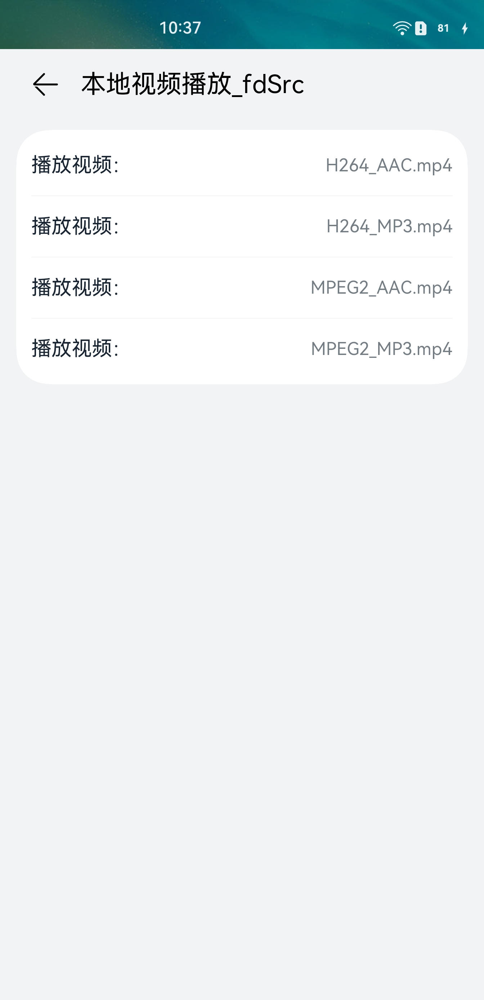
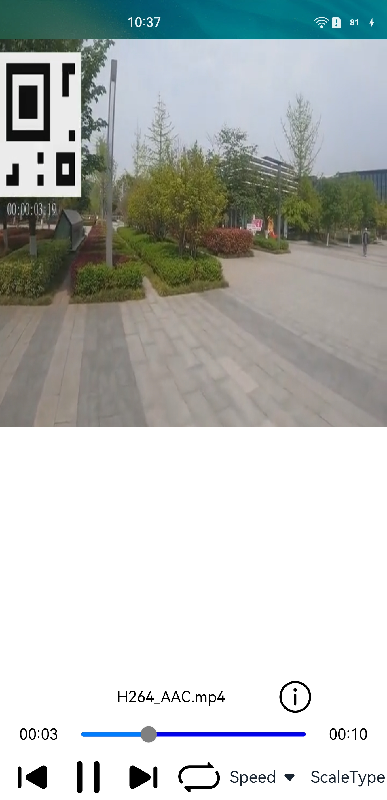

#  AVPlayer音视频播放

### 介绍

本示例展示了AVPlayer组件的基本功能，以及如何控制播放状态的相关能力。包括音频播放，视频播放，网络播放等。

1.进入首页点击需要播放的模式。

2.点击想要播放的预制视频或者音频,如播放本地视频需要先将待播放码流放到媒体资源目录下：/storage/media/100/local/files/Videos

3.进入播放界面点击播放按键开始播放。

4.点击暂停、切换视频、循环播放、倍速等按键控制播放操作。

### 效果预览

 


### 使用说明

1. 启动应用后给予应用相应的权限：媒体文件读写权限。
2. 应用分为本地播放与网络播放，其中本地播放包括：本地视频(url)、本地视频(fdSrc)、本地音频播放；网络播放包括：http播放、https播放、hls播放、网络直播。
3. 本地播放视频播放、本地音频播放需要提前将待播放视频放到单板媒体库目录下；网络播放需要链接相应的网络。
4. 应用包括播放、暂停、前向切换视频、后向切换视频、循环播放、倍速播放、视频缩放、seek、音量调节等常用功能

### 目录

仓目录结构如下：

```
entry/src/main/ets/
|---common
|   |---bean                               # list列表所需参数
|   |---constants
|       |---CommonConstants.ets            # 具体播放资源文件名、网络地址以及部分常亮定义
|---entryability
|   |---EntryAbility.ts                    # 应用启动入口，权限申请
|---model
|   |---Logger.ts                          # 打印函数封装文件
|   |---MediaLibraryUtils.ts               # 文件打开工具类
|---pages
|   |---AudioPlayer.ets                    # 音频播放界面
|   |---HlsPlayer.ets                      # HLS播放界面
|   |---HttpsPlayer.ets                    # HTTP/HTTPS播放界面
|   |---LivePlayer.ets                     # 网络直播界面
|   |---VideoPlayer_fdSrc.ets              # 本地视频(fdSrc)播放界面
|   |---VideoPlayer_url.ets                # 本地视频(url)播放界面
|   |---ListPage.ets                       # list列表主界面，选择播放功能
|   |---DetailPage.ets                     # list列表子界面，选择播放视频
|---view
|   |---AudioDetailListComponent.ets       # list列表跳转音频播放界面 
|   |---HlsDetailListComponent.ets         # list列表跳转HLS播放界面
|   |---HttpsDetailListComponent.ets       # list列表跳转HTTP/HTTPS播放界面 
|   |---LiveDetailListComponent.ets        # list列表跳转网络直播界面
|   |---VideoDetailListComponent.ets       # list列表跳转本地视频(url)播放界面 
|   |---VideoFdSrcDetailListComponent.ets  # list列表跳转本地视频(fdSrc)播放界面
|   |---ListAreaComponent.ets              # list列表控件
|   |---ListItemComponent.ets              # list子界面控件 
|---viewmodel                              # list列表参数获取，包括各个子目录的数据
```

### 相关权限

本示例需要在module.json5中配置如下权限:

写媒体文件权限：ohos.permission.WRITE_MEDIA

读媒体文件权限：ohos.permission.READ_MEDIA

### 约束与限制

1.本示例仅支持标准系统上运行,支持设备:NOAH/WGR/RK3568。

2.本示例仅支持API version 9版本SDK。

3.本示例需要使用DevEco Studio 3.1  (Build Version: 3.0.1.200, built on Feburary 16, 2023)才可编译运行。


