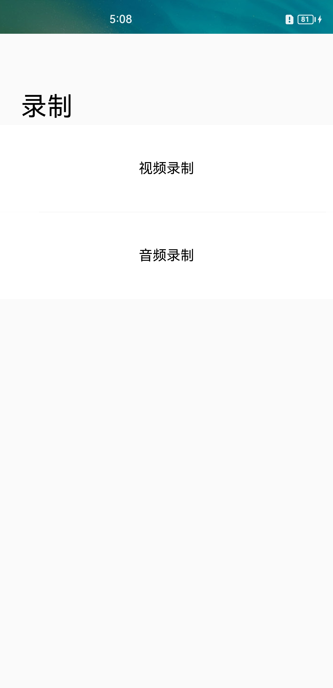
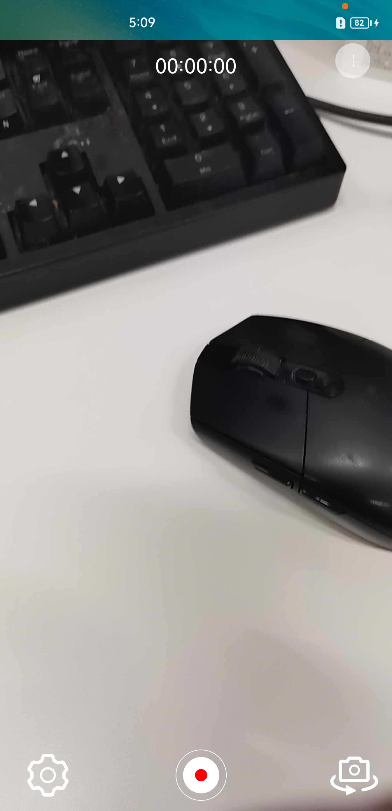
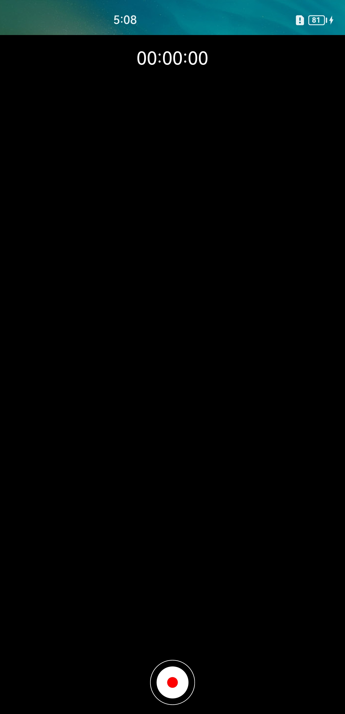

# AVRecorder

## 介绍

音视频录制Demo是基于AVRecorder接口开发的实现音频录制和视频录制功能的demo，音视频录制的主要工作是捕获音频信号，接收视频信号，完成音视频编码并保存到文件中，帮助开发者轻松实现音视频录制功能，包括开始录制、暂停录制、恢复录制、停止录制、释放资源等功能控制。它允许调用者指定录制的编码格式、封装格式、文件路径等参数。

本示例主要使用@ohos.multimedia.media中的AVRecorder接口实现了录制功能；

另外辅助使用@ohos.multimedia.medialibrary接口，实现了创建录制文件功能；使用@ohos.multimedia.camera接口，实现了相机预览及出流功能。

### 效果预览

| 主页                                                         | 视频录制                                                     | 音频录制                                                     |
| ------------------------------------------------------------ | ------------------------------------------------------------ | ------------------------------------------------------------ |
|  |  |  |

使用说明

1. 在主界面，可以点击视频录制、音频录制进入对应功能界面；
2. 点击视频录制页面，进入页面呈现摄像头预览画面，用户可以通过点击左下角的设置图标进行视频分辨率、帧率、编码格式参数设置，长按右上角详情图标可以查看当前配置参数，点击”开始“”暂停“”恢复“”停止“等对应图标按钮进行视频录控相关操作。
3. 点击音频录制页面，用户可以通过点击左下角的设置图标进行音频声道、采样率参数设置，长按右上角详情图标可以查看当前配置参数，点击”开始“”暂停“”恢复“”停止“等对应图标按钮进行音频录控相关操作。

### 工程目录

给出项目中关键的目录结构并描述它们的作用，示例如下：

```
entry/src/main/ets/
|---entryability
|   |---data                               // 能力生命周期管理
|---pages
|   |---ListPage.ets                       // 首页，选择音频录制或者视频录制
|---recorder
|   |---ARecorder.ets                      // 音频录制页面
|   |---VRecorder.ets                      // 视频录制页面
|---utils
|   |---DateTimeUtils                      // 录制显示时间转换函数
|   |---SaveCameraAsset.ets                // 创建录制文件相关函数
```

### 具体实现

* 录控功能接口调用实现在ARecorder.ets和VRecorder.ets
  * 调用create()、prepare()、getInputSurface()、start()、pause()、resume()、stop()、reset()、release()接口实现录制器的创建、准备、录控操作、重置、销毁实例等功能；
  * 视频录制VRecorder.ets调用Camera接口实现相机出流功能配合视频录制功能，相机的实现方法参考自相机接口@ohos.multimedia.camera
* 调用MediaLibrary实现创建录制文件代码在SaveCameraAsset.ets，实现方法参考@ohos.multimedia.medialibrary接口说明

### 相关权限

音视频录制涉及的权限包括：

ohos.permission.MICROPHONE

ohos.permission.CAMERA

ohos.permission.READ_MEDIA

ohos.permission.WRITE_MEDIA

ohos.permission.LOCATION

### 约束与限制

1.本示例仅支持在标准系统上运行，支持设备：手机。

2.本示例仅支持API9版本SDK，版本号：3.2.10.8;系统权限的系统接口。本示例需要使用相机系统权限的系统接口，使用Full SDK时需要手动从镜像站点获取，并在DevEco Studio中替换。

3.本示例需要使用DevEco Studio 3.1 (Build Version:3.1.0.200, built on Feburary 16, 2023)才可编译运行。

4.相机为系统接口，需要配置高权限签名，相关权限级别可查阅权限列表，需要手动配置对应级别的权限签名。

